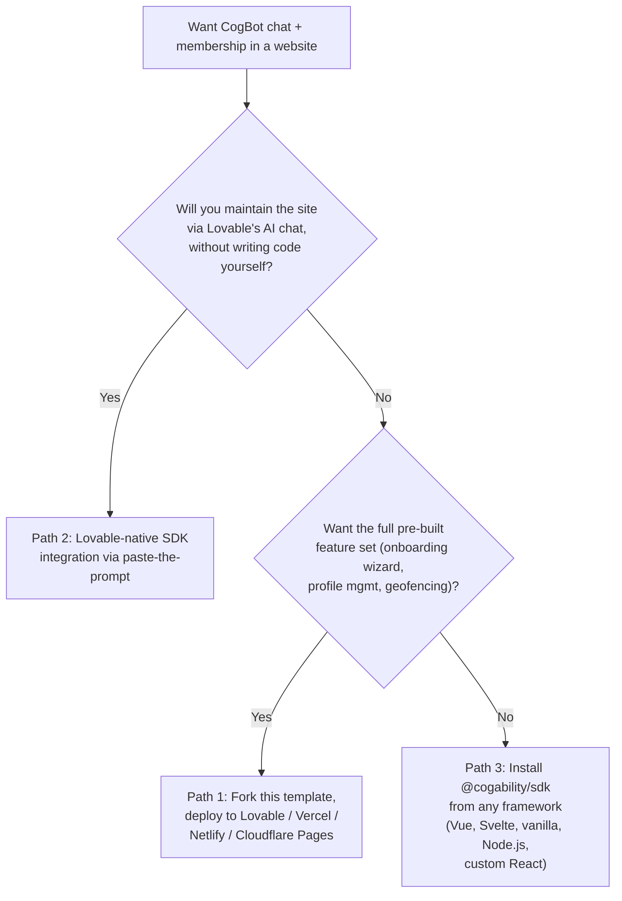
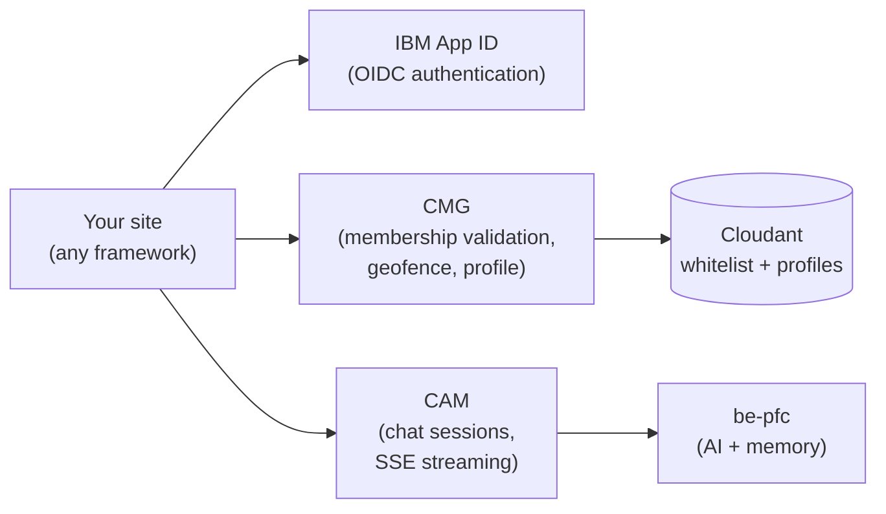

# Deployment Guidance

Three supported paths to put CogBot chat and IBM App ID membership into a website. Pick the one that matches your situation, then follow the step-by-step for that path plus the shared [Backend allowlisting](#backend-allowlisting) section at the end.

**Quick recommendation:** if you are a non-technical user who wants to host on Lovable and never touch GitHub, npm, or a code editor, choose **Path 2**. If you want the full pre-built feature set (onboarding wizard, profile management, member roles, geofencing) and are comfortable with GitHub, choose **Path 1**. For everything else, **Path 3**.

---

## Pick your path



| Path | Best for | Effort | Result |
|---|---|---|---|
| [Path 1](#path-1-fork-this-template-deploy-to-a-static-host) | New branded membership site, full feature set, comfortable with GitHub | ~1 hour | Fully-featured SPA: public chat, App ID sign-in, member onboarding, gated pages, streaming chat, geofencing |
| [Path 2](#path-2-lovable-native-via-the-integration-prompt) | Non-technical Lovable customer who wants Lovable's AI to handle all future changes | ~5 minutes (paste, publish) | CogBot chat + App ID sign-in + members area wired into a Lovable-native TanStack Start site. Maintainable entirely via Lovable's chat. |
| [Path 3](#path-3-use-cogabilitysdk-from-any-web-app-or-nodejs-agent) | Any non-React site, non-Lovable host, custom React app, or Node.js agent | Varies by framework | Direct HTTP clients — you own the UI entirely |

---

## What all three paths share

Regardless of frontend choice, CogBot membership sites speak to the same three backend services:



Six configuration values wire your site to this backend, regardless of path:

| Value | What it is | Where it goes |
|---|---|---|
| `APPID_CLIENT_ID` | App ID application client ID | `AuthClient` (OIDC login) |
| `APPID_OAUTH_SERVER_URL` | App ID OAuth server URL (tenant-specific) | `AuthClient` (OIDC discovery) |
| `CMG_URL` | Your deployed CMG base URL | `CmgClient` |
| `SITE_NAMESPACE` | Namespace key for member roles | `CmgClient` |
| `CAM_URL` | Your deployed CAM base URL | `CamClient` |
| `COGBOT_ID` | CogBot identifier (e.g. `mc_0091:full`) | `CamClient` |
| `ROUTER_MODE` (optional) | `path` (default) or `hash`. Use `hash` on hosts without SPA fallback (Lovable `*.lovable.app`, GitHub Pages without 404.html hack). Affects router type and OAuth `redirect_uri` shape. | `App` (`@cogability/membership-kit`) and `AuthClient` redirect URI |

In Vite projects these are named `VITE_*` (e.g. `VITE_CMG_URL`). In Node or other runtimes, name them however your framework wants. See [Obtaining credentials](#obtaining-credentials) for where to get the values.

After your site is live at its production URL, that origin must be added to **four** allowlists before the SDK will work end-to-end. CogAbility ops typically runs all four for you via [`tools/provision-lovable-customer.sh`](tools/provision-lovable-customer.sh) — you just send your URL to your CogAbility contact. The mechanics of the four mutations are documented in [Backend allowlisting](#backend-allowlisting).

---

## Path 1: Fork this template, deploy to a static host

### When to use

- You are building a new membership site from scratch.
- You want the full feature set (public chat, App ID sign-in, onboarding wizard, profile page, members area with streaming chat, geofencing, access gates) without writing any UI code.
- You are comfortable editing a single JavaScript config file to customize content and branding.

### Prerequisites

- A GitHub account with access to where the forked repo will live (usually your own org).
- A hosting account: [Lovable](https://lovable.dev), [Vercel](https://vercel.com), [Netlify](https://netlify.com), or [Cloudflare Pages](https://pages.cloudflare.com).
- Six credentials values from your CogAbility contact — see [Obtaining credentials](#obtaining-credentials).
- Your branding: site name, bot name, hero copy, feature cards, testimonials, logos.

### Step 1 — Create your repo from the template

Click **Use this template → Create a new repository** on [this repo's GitHub page](https://github.com/CogAbility/cogbot-membership-website-template). Pick a target owner (your org) and name (e.g. `acme-membership`). Choose public or private at your discretion — the repo contents aren't sensitive.

This creates a clean copy with no upstream link to the template. You can pull future template improvements manually as cherry-picks or merges; this is rare.

### Step 2 — Customize branding and copy

Edit [`site.config.js`](site.config.js) — every user-visible string lives here. Quick checklist:

- `siteName`, `botName`, `orgName`, `orgUrl`, `poweredByName`
- `meta.title`, `meta.description` (page title + SEO + social sharing)
- `header.projectBadge`, `header.signInLabel`
- `hero.tagline`, `hero.subtitle`, `hero.stats`
- `features.items` (grid of feature cards)
- `testimonials.items`
- `about.paragraphs`, `about.checklist`
- `members.quickTips`, `members.botDescription`
- `onboarding` (step labels, welcome copy)
- `profile` (labels, headings)
- `footer` (brand name, nav links, copyright)

Replace the placeholder images in `public/`:

- `public/bot-icon.svg` — chat avatar
- `public/org-logo.svg` — "Presented by" logo
- `public/favicon.svg` — browser tab icon

If you use different file names or formats (`.webp`, `.png`, etc.), update the `images:` section in `site.config.js` accordingly.

Theme colors live in [`src/index.css`](src/index.css) under `:root` as HSL triples. The hero gradient adapts automatically to `--primary`.

### Step 3 — Add production env vars

The template's `.env.example` documents the six required `VITE_*` vars (plus an optional seventh, `VITE_ROUTER_MODE`, for hosts without SPA fallback). For **production**, create a committed `.env.production` file at the project root:

```bash
VITE_APPID_CLIENT_ID=<your_client_id>
VITE_APPID_OAUTH_SERVER_URL=<your_oauth_server_url>
VITE_CMG_URL=<your_cmg_url>
VITE_SITE_NAMESPACE=<your_namespace>
VITE_COGBOT_HOST=<your_cam_url>
VITE_COGBOT_ID=<your_cogbot_id>

# Optional. Set to "hash" only on hosts that don't do SPA fallback
# (Lovable *.lovable.app, GitHub Pages without 404.html hack).
# Default: "path" (clean URLs, conventional /callback redirect).
# VITE_ROUTER_MODE=hash
```

Why committed, not secret: these values end up in the public JavaScript bundle anyway (anyone can extract them from DevTools). They are identifiers, not credentials. The template's `.gitignore` excludes `.env` and `.env.local` but NOT `.env.production`, so committing this file is the intended pattern.

For **local development** with a dev backend, `.env.local` (gitignored) overrides `.env.production`:

```bash
cp .env.example .env.local
# edit .env.local with dev values
```

### Step 4a — Deploy to Lovable

> **Most non-technical Lovable customers should use [Path 2](#path-2-lovable-native-via-the-integration-prompt) instead.** Path 2 is much simpler (paste one prompt, no GitHub) and lets you iterate the site indefinitely via Lovable's chat. Use Path 1 + Lovable only if you specifically want the kit's full pre-built feature set (onboarding wizard, structured profile editing, geofencing, multi-tier role gating) AND you are comfortable with the GitHub-sync gymnastics below.

Lovable hosts your site AND gives you an AI editing interface. Worth the extra setup if non-technical stakeholders will be iterating on copy AND you need the full kit features.

**Important caveat**: Lovable (as of 2026) does not support direct "import from GitHub." Their GitHub sync is bidirectional code-mirroring, but you cannot point a new Lovable project at an existing GitHub repo. Workaround:

1. **Create an empty Lovable project.** Use a minimal seed prompt:

   > This project will be replaced wholesale via GitHub sync after we connect it. I am porting an existing React + Vite + Tailwind app from another repo. Please create the smallest possible scaffold — a single hello-world page, no router, no UI library, no extra components. Do not add Lovable Cloud features (no auth, no database, no storage). Project slug: `<your-slug>`. Just bootstrap the bare minimum so I can connect GitHub and overwrite it.

   Wait for Lovable's build to finish. You will get a URL like `https://<your-slug>.lovable.app`.

2. **Connect to GitHub.** Sidebar → **Connectors** → **GitHub** → **Connect project**. When the GitHub App install dialog appears, install the app on the same org/owner where your forked template lives. Click **Create Repository**. Lovable creates a NEW repo (separate from your template fork) and pushes its seed scaffolding to it.

3. **Clone Lovable's new repo locally:**

   ```bash
   git clone https://github.com/<owner>/<lovable-repo-name>.git
   cd <lovable-repo-name>
   ```

4. **Wipe Lovable's seed (preserving `.git/`):**

   ```bash
   find . -mindepth 1 -maxdepth 1 -not -name '.git' -exec rm -rf {} +
   ```

5. **Copy your customized template over:**

   ```bash
   rsync -a \
     --exclude='.git' \
     --exclude='node_modules' \
     --exclude='dist' \
     --exclude='.env' \
     --exclude='.env.local' \
     --exclude='.env.*.local' \
     /path/to/your/forked-template/ \
     ./
   ```

6. **Verify the build works locally:**

   ```bash
   npm install
   npm run build
   ```

7. **Commit and push:**

   ```bash
   git add -A
   git commit -m "Replace Lovable seed scaffold with customized template"
   git push origin main
   ```

8. **Wait 3–7 minutes.** Lovable's deploy is NOT on the same tick as the GitHub push. Verify by curling the live URL and checking the bundle hash:

   ```bash
   curl -s https://<your-slug>.lovable.app | grep -o '/assets/[a-z-]*\.js' | head -1
   # Compare to your local `ls dist/assets/*.js` — they should match
   ```

**Three Lovable quirks you will encounter:**

1. **The preview pane inside Lovable's editor stays blank or stale** even when the live deploy works fine. Always verify at the live `*.lovable.app` URL, not the embedded preview.

2. **Lovable's AI will suggest "Add app entry clean-up", "Verify Tailwind setup", "Add basic favicon", "Add root HTML metadata"** and similar tasks. These rewrite your code to match Lovable's default stack (TanStack Start + Tailwind v4 + TypeScript). Do not click them — they will break your site.

3. **Keep code changes in GitHub.** Lovable's 2-way sync means edits made in Lovable's editor push back to GitHub. For anything non-trivial, edit the GitHub repo directly (locally, via Cursor, via PR). Use Lovable's editor only for minor copy tweaks that the AI is good at.

**Static host caveat — Lovable does not do SPA fallback:**

Lovable's `*.lovable.app` static host returns 404 for any path that isn't an actual file in `dist/`. `_redirects` files are not honored on `*.lovable.app`. This breaks deep links like `/members` and the OAuth `/callback` route.

The kit (`@cogability/membership-kit ^0.3.0`) handles this when you set `VITE_ROUTER_MODE=hash` in `.env.production`. URLs become `/#/members`, and the OAuth redirect lands on `/` where the kit auto-detects `?code=&state=` and finishes login. Pair this with registering `https://<your-slug>.lovable.app/` (the site root, with trailing slash) in App ID — see [Mutation 3](#mutation-3-app-id-web-redirect-urls-ibm-cloud-ui).

### Step 4b — Deploy to Vercel, Netlify, or Cloudflare Pages

Simpler than Lovable. All three auto-detect Vite projects.

**Vercel:**

1. Go to [vercel.com/new](https://vercel.com/new), import your GitHub repo.
2. Framework Preset: **Vite** (auto-detected).
3. Build Command: `npm run build` (default).
4. Output Directory: `dist` (default).
5. Environment Variables: add the six `VITE_*` from your `.env.production` (Vercel reads them from both places, but adding to the dashboard is explicit and reliable) (no `VITE_ROUTER_MODE` needed — these hosts do SPA fallback natively, so the default `path` mode works).
6. Deploy. URL: `https://<project>.vercel.app` or your custom domain.

**Netlify:**

1. [netlify.com → New site from Git](https://app.netlify.com/start), connect your repo.
2. Build command: `npm run build`.
3. Publish directory: `dist`.
4. Environment Variables: same six `VITE_*` (no `VITE_ROUTER_MODE` needed — these hosts do SPA fallback natively, so the default `path` mode works).
5. Deploy. URL: `https://<project>.netlify.app` or custom domain.

**Cloudflare Pages:**

1. [dash.cloudflare.com → Pages → Create a project](https://dash.cloudflare.com/?to=/:account/pages) → Connect to Git.
2. Build command: `npm run build`.
3. Build output directory: `dist`.
4. Environment variables: same six `VITE_*` (Pages injects them at build time) (no `VITE_ROUTER_MODE` needed — these hosts do SPA fallback natively, so the default `path` mode works).
5. Deploy. URL: `https://<project>.pages.dev` or custom domain.

### Step 5 — Add your production origin to the three backend allowlists

After the first deploy, note your production URL (e.g. `https://acme-membership.lovable.app` or `https://acme.vercel.app` or `https://members.acme.com`).

Either do the three allowlist mutations yourself (if you have access) OR send your production URL to your CogAbility contact. See [Backend allowlisting](#backend-allowlisting) for the exact commands.

Until all three allowlists are updated, the live site will show:
- CORS errors in DevTools console when the page tries to check geofence or validate membership
- `redirect_uri_mismatch` error after clicking Sign In
- Chat widget showing "Unable to connect to Buddy"

### Step 6 — Smoke test

Open your production URL in an incognito window with DevTools Network tab open. Verify each leg:

1. **Anonymous geofence probe.** `GET <CMG_URL>/auth/geofence/check?namespace=<namespace>` should return `200 { geofenced: false }` (assuming you are inside the allowed geo). The landing page should render normally.
2. **Anonymous chat.** The public BuddyChat widget on the landing page should initialize (`POST <CAM_URL>/init`) and respond to messages.
3. **Sign in.** Click the sign-in button. App ID popup opens. After login: in `path` mode (default) you land at `<your-site>/callback`; in `hash` mode (Lovable, GitHub Pages) you briefly land at `<your-site>/?code=&state=` and the kit silently navigates to `<your-site>/#/...`. Either way, `POST <CMG_URL>/auth/validate` returns membership info next. New users go to `/onboarding`; existing members go to `/members`.
4. **Authenticated chat.** On `/members`, send a chat message. Streaming response arrives via SSE. Agent has access to your profile + long-term memory.

If any leg fails, cross-reference the [Troubleshooting](#troubleshooting) table.

---

## Path 2: Lovable-native via the integration prompt

### When to use

- You want a Lovable-hosted membership site that **you maintain entirely via Lovable's chat** (no GitHub, no Cursor, no terminal, no npm).
- You are non-technical, or technical enough but prefer Lovable's AI handles the code.
- You don't need the full pre-built kit features (onboarding wizard, structured profile management, member roles, geofencing). If you do need those, choose Path 1 instead.

This path was validated end-to-end in April 2026 against a Lovable TanStack Start project. The integration takes about 5 minutes from start to working sign-in.

### Result

A Lovable-native TanStack Start site with:
- Anonymous chat on the landing page
- "Sign in" link in the header that redirects through App ID OIDC (Google + email/password)
- `/members` route gated to authenticated members, with authenticated chat
- `/access-denied` route for non-members
- All future changes (copy, layout, branding, even adding new gated pages) go through Lovable's chat

What this path **does not** include out of the box: onboarding wizard, structured profile editing, geofencing, multi-tier role gating, streaming animation, themed chat widget. These can be added via follow-up Lovable chat prompts but are not part of the validated integration. See "[What this prompt does NOT do](docs/lovable-sdk-integration-prompt.md#what-this-prompt-does-not-do)" in the integration prompt doc.

### Prerequisites

1. **A Lovable project** at `https://<slug>.lovable.app/` with a membership-style scaffold. If you don't have one yet, bootstrap it in Lovable using a prompt like: *"Build a membership-style site for [your topic]. Include a hero, a sign-in link in the header, a `/members` route, and a `/auth` route for sign-in. Use TanStack Start (the default Lovable framework). Don't add a database or backend — auth and members will be handled by an external integration."*
2. **Six configuration values** from your CogAbility contact:
   - `APPID_OAUTH_SERVER_URL`
   - `APPID_CLIENT_ID`
   - `CAM_HOST`
   - `CMG_HOST`
   - `COGBOT_ID`
   - `SITE_NAMESPACE`
3. **CogAbility ops has run the per-customer onboarding** for your site URL. This adds your origin to four allowlists (CAM CORS, CMG, App ID redirect URLs, cogbot host config). See [Backend allowlisting](#backend-allowlisting). Without this, sign-in fails with `redirect_uri_mismatch` and the bot returns empty messages.

### Step 1 — Send your URL to CogAbility

Email your CogAbility contact with your Lovable URL (e.g. `https://acme-membership.lovable.app`). They will run [`tools/provision-lovable-customer.sh`](tools/provision-lovable-customer.sh) and confirm when all four allowlists are in place. This usually takes them a few minutes once they get the message. **Do this before pasting the integration prompt** — without the allowlists, you'll see misleading "everything works but the bot is mute" symptoms that look like a code bug but aren't.

### Step 2 — Paste the integration prompt into Lovable's chat

The validated, paste-ready prompt with all spike fixes baked in lives at:

→ [`docs/lovable-sdk-integration-prompt.md`](docs/lovable-sdk-integration-prompt.md)

It contains:
- Six placeholders to substitute with your config values
- Hard rules for Lovable's AI (don't install other packages, don't move calls to server functions, don't replace the SDK with a custom OIDC flow, etc.)
- Step-by-step file creations for `src/lib/cogability.ts`, `src/routes/callback.tsx`, `src/routes/auth.tsx` (override), `src/components/MemberGate.tsx`, `src/components/CogBotChat.tsx`, `src/components/SignInButton.tsx`, `src/routes/access-denied.tsx`
- An end-of-prompt checklist Lovable's AI must return

Open the file, copy the entire fenced block under "The prompt to paste", substitute the six placeholders with your real values, and paste the whole block as a single message into Lovable's chat at your project. **Do not split it across multiple messages** — Lovable's AI processes one message as one transaction.

### Step 3 — Verify Lovable's report and Publish

Lovable's AI returns a checklist of files created and modified. The expected list is documented in the integration prompt under "[What you should see after Lovable finishes](docs/lovable-sdk-integration-prompt.md#what-you-should-see-after-lovable-finishes)". If anything is off, see "[Iteration troubleshooting](docs/lovable-sdk-integration-prompt.md#iteration-troubleshooting)" — each common failure mode has a recovery prompt you can paste back into Lovable.

Once the report looks right, click **Publish** in Lovable (top-right). Wait until it says "up to date".

### Step 4 — Smoke test

Open `https://<slug>.lovable.app/` in a fresh incognito window and walk through the seven-step smoke test in the integration prompt under "[Smoke test (run after Publish)](docs/lovable-sdk-integration-prompt.md#smoke-test-run-after-publish)".

The most common partial-pass after a successful integration is: sign-in works and authenticated chat returns substantive responses, but the *initial greeting* on page load is empty. That's the cogbot's host config not having a welcome string set for your origin (separate from host *recognition*, which is what the ops onboarding script sets). Chat itself works in both anonymous and authenticated modes; only the initial greeting is empty. Ask your CogAbility contact to set a welcome string for your origin if you want one.

### Long-term maintenance via Lovable's chat

Once the integration is in place, you can ask Lovable's chat to make any future changes:

- *"Add a profile page at /profile that shows the user's email and a Sign Out button."*
- *"Change the chat widget to show three animated dots while the bot is thinking."*
- *"Add a geofence check on the landing page using cmg.checkGeofence(). If geofenced is true, replace the page contents with a polite block message."*
- *"Add a contact form on the landing page that sends the message via mailto."*
- *"Make the header navigation responsive — hamburger menu on mobile."*

Lovable's AI handles each as a normal site change. The CogBot integration files don't need re-paste unless you accidentally delete them (see iteration troubleshooting if so). For changes to the OIDC config (e.g. swapping App ID instances), edit the values in `src/lib/cogability.ts` directly via Lovable chat — there's an example targeted-edit prompt in the integration prompt doc.

### Why not the full membership-kit on Lovable?

Lovable's default stack (TanStack Start + TanStack Router + Tailwind v4 + TypeScript + Bun + Cloudflare Workers) is fundamentally incompatible with the kit's stack (React Router v7 + Tailwind v3 + JavaScript + Vite static build + npm). Three blocking conflicts: (1) two routers can't own the same URLs, (2) Tailwind v3 class semantics break under v4, (3) the kit expects a Vite `main.jsx` mount point and TanStack Start expects `__root.tsx`. Path 1 deployed to Lovable works around this by treating Lovable as a static host and using `hash` router mode (see [Step 4a](#step-4a--deploy-to-lovable)) — but that path requires GitHub-sync gymnastics and is fragile under Lovable AI edits. Path 2's "build inside Lovable's native stack with just the SDK" approach avoids all of this, at the cost of not having the kit's pre-built UI.

---

## Path 3: Use `@cogability/sdk` from any web app or Node.js agent

### When to use

- You are integrating with an existing site that is NOT a Lovable project and NOT a React app.
- You are building a Node.js agent, a Cloudflare Worker, or other server-side code that needs to call CAM or CMG.
- You want the minimum possible dependency surface — just HTTP clients.

### Prerequisites

- Node.js 18+ or a modern browser with `fetch` support.
- The same six configuration values as the other paths (plus optional `VITE_ROUTER_MODE` if you are building a browser SPA on a host without SPA fallback).

### Step 1 — Install

```bash
npm install @cogability/sdk
```

For browser OIDC flows (Path 3 browser case), also install the peer:

```bash
npm install oidc-client-ts
```

Node.js agents and server code typically skip `oidc-client-ts` — they receive tokens from elsewhere (the calling request's auth header, a pre-provisioned service account, etc.).

### Step 2a — Browser integration (Vue, Svelte, vanilla JS, Angular, etc.)

Same three clients as Path 2 (`CamClient`, `CmgClient`, `AuthClient`). The SDK has no React dependency — `AuthClient` uses only `window`, `fetch`, and `oidc-client-ts`, all framework-neutral.

**Vue (Options API) chat example:**

```vue
<script>
import { CamClient, BrowserSessionStore } from "@cogability/sdk";

export default {
  data() {
    return {
      cam: null,
      messages: [],
      input: "",
      ready: false,
    };
  },
  async mounted() {
    this.cam = new CamClient({
      host: import.meta.env.VITE_COGBOT_HOST,
      cogbotId: import.meta.env.VITE_COGBOT_ID,
      sessionStore: new BrowserSessionStore(),
    });
    await this.cam.initAnonymous();
    await this.cam.initCogbot();
    this.ready = true;
  },
  methods: {
    async send() {
      const text = this.input;
      this.input = "";
      this.messages.push({ role: "user", text });
      const botIdx = this.messages.push({ role: "bot", text: "" }) - 1;
      for await (const ev of this.cam.streamMessage(text)) {
        // Handle both partial_object (progressive tokens) and final_response
        // (the committed assistant message). The final text can arrive only
        // in final_response if streaming is fast or disabled.
        if (ev.eventName === "partial_object" || ev.eventName === "final_response") {
          const parts = CamClient.parseResponseGeneric(ev.data)
            .filter((g) => g.response_type === "text" && g.text);
          if (parts[0]) this.messages[botIdx].text = parts[0].text;
        }
      }
    },
  },
};
</script>
```

**Svelte, Angular, vanilla JS** — same pattern. See [`@cogability/sdk` README — Vue / vanilla JS](https://www.npmjs.com/package/@cogability/sdk#vue--vanilla-js--drop-in-chat-widget).

**For React (non-template, non-Lovable)**, the validated TypeScript file contents in [`docs/lovable-sdk-integration-prompt.md`](docs/lovable-sdk-integration-prompt.md) (Steps 2–8: `src/lib/cogability.ts`, `MemberGate`, `CogBotChat`, callback route, sign-in button, access-denied route) are framework-agnostic enough to drop into Next.js, Remix, or a custom Vite + React Router app with only minor route-convention adjustments. Skip the Lovable-specific guardrails in that prompt and use the code blocks as React patterns.

**SDK API gotchas** (validated against CAM as of April 2026):
- `cam.fetchGreeting()` returns `{ output: Generic[] }` — the array is at `.output` directly. **Do not use `CamClient.parseResponseGeneric(greeting)` for greeting** — that helper expects `.output.generic`, which is the `sendMessage` / `streamMessage final_response` shape, not the greeting shape. Iterate `greeting.output` instead.
- `cam.streamMessage(text)` yields three event types: `partial_object` (progressive tokens), `object_ready` (a finished cascade layer), and `final_response` (the committed assistant message). Handle both `partial_object` AND `final_response` — fast or non-streaming responses skip `partial_object` entirely and put the full text in `final_response`.
- Filter generic items with `g.response_type === "text" && g.text` (not just `g.response_type === "text"`) to avoid rendering empty placeholder partials.

### Step 2b — Node.js agent

Node agents skip OIDC entirely — they receive tokens from an upstream call (e.g. an API request) or are pre-provisioned with service-account credentials.

```js
import { CamClient, CmgClient, MemorySessionStore } from "@cogability/sdk";

const cam = new CamClient({
  host: process.env.COGBOT_HOST,
  cogbotId: process.env.COGBOT_ID,
  sessionStore: new MemorySessionStore(),
  getHostUrl: () => "https://agent.example.com",
});

const cmg = new CmgClient({
  host: process.env.CMG_URL,
  namespace: process.env.SITE_NAMESPACE,
});

// Anonymous session
await cam.initAnonymous();
await cam.initCogbot();

// Authenticated: pass a pre-obtained idToken
const membership = await cmg.validateMembership(idToken);
if (membership.isMember) {
  await cam.initAuthenticated(idToken);
}

// Stream a response
for await (const { eventName, data } of cam.streamMessage("What are my benefits?")) {
  if (eventName === "final_response") {
    const text = CamClient.parseResponseGeneric(data)
      .filter((g) => g.response_type === "text")
      .map((g) => g.text)
      .join("\n");
    console.log(text);
  }
}
```

Use `MemorySessionStore` (in-process Map) instead of `BrowserSessionStore` (which wraps `window.sessionStorage` and does not exist in Node).

### Step 2c — Cloudflare Worker / edge runtime

Same pattern as Node. Use `MemorySessionStore`. Do not use `AuthClient` (no DOM). Pass tokens explicitly from the incoming request's `Authorization` header.

```js
import { CamClient, CmgClient, MemorySessionStore } from "@cogability/sdk";

export default {
  async fetch(request, env) {
    const idToken = request.headers.get("Authorization")?.replace(/^Bearer /, "");
    const cmg = new CmgClient({ host: env.CMG_URL, namespace: env.SITE_NAMESPACE });
    const membership = await cmg.validateMembership(idToken);
    if (!membership.isMember) return new Response("Unauthorized", { status: 401 });
    // ... proceed with chat, profile, etc.
  },
};
```

### Step 2d — Handoff from an existing auth system

If your site already has authentication (Auth0, NextAuth, Cognito, Clerk, Supabase Auth, etc.), you can skip `AuthClient` entirely. What CMG needs is an `idToken` that App ID issued for the user. If your existing auth system federates to App ID (e.g. you configured Auth0 to use App ID as an upstream OIDC provider), you can extract the App ID-issued token and pass it to `cmg.validateMembership(idToken)` + `cam.initAuthenticated(idToken)`.

If your auth system does NOT federate to App ID, you need a parallel auth flow via `AuthClient` or you need to work with CogAbility to configure federation. Contact your CogAbility contact for the options.

### Step 3 — Backend allowlisting

Same four mutations as the other paths (CAM CORS, CMG `ALLOWED_ORIGINS`, App ID redirect URLs, cogbot major config). If you are running a browser SPA, your production origin must be in CAM and CMG allowlists. If you are running a Node agent or edge worker, your origin is either absent (server-to-server calls bypass browser CORS) OR present as your worker's origin. App ID redirect URLs apply only if you are doing browser OIDC via `AuthClient`. Cogbot major config (host recognition) applies to anyone calling CAM with a `host_url` parameter — usually only browser SPAs.

See [Backend allowlisting](#backend-allowlisting). For Lovable-hosted browser SPAs, ops typically runs all four via [`tools/provision-lovable-customer.sh`](tools/provision-lovable-customer.sh).

### Step 4 — Smoke test

From a browser context:

```js
const res = await fetch(`${CMG_URL}/auth/geofence/check?namespace=${NAMESPACE}`);
console.log(await res.json()); // should return { geofenced: false, ... }
```

From Node:

```js
import { CmgClient } from "@cogability/sdk";
const cmg = new CmgClient({ host: CMG_URL, namespace: NAMESPACE });
console.log(await cmg.checkGeofence());
```

---

## Backend allowlisting

Your site's production origin must be added to **four** separate allowlists before the SDK works end-to-end. If any of the four is missing, you get a specific failure mode listed in [What happens if you skip one](#what-happens-if-you-skip-one). This section applies equally to Paths 1, 2, and 3.

Four allowlists, four different mutation mechanisms:

| # | What | Where it lives | How to mutate |
|---|---|---|---|
| 1 | CAM CORS | Cloudant `cors-whitelist` DB, doc with `_id` = `<CORS_WHITELIST_KEY>`, field `whitelist` (array of origins) | HTTP PUT the doc back with `_rev` + updated array |
| 2 | CMG `ALLOWED_ORIGINS` | Kubernetes Secret `cmg-secrets` in the namespace where CMG runs, key `ALLOWED_ORIGINS` (comma-separated string) | `kubectl patch` the secret, then `kubectl rollout restart` the CMG deployment |
| 3 | App ID web redirect URLs | IBM Cloud console → App ID instance → Applications → your client → Web redirect URLs (list) | Click in the IBM Cloud UI (no public API for this field) |
| 4 | Cogbot major config (host recognition + welcome message) | Tenant-specific — usually a Cloudant cogbot doc or CTM config | Manual edit by CogAbility ops; varies per tenant |

**For Paths 1, 2, and 3, CogAbility ops runs all four for you via [`tools/provision-lovable-customer.sh`](tools/provision-lovable-customer.sh).** The script automates Mutations 1 and 2 fully, and prints precise instructions for Mutations 3 and 4 (which require manual UI / tenant-specific edits). As a customer, all you need to do is send your production URL to your CogAbility contact and confirm when they say all four are in place.

Who runs these steps depends on access:

- **If you are CogAbility ops** and have access to the production AWS account, the EKS cluster, and IBM Cloud, run [`tools/provision-lovable-customer.sh https://<customer-origin>`](tools/provision-lovable-customer.sh) — it does Mutations 1 and 2 automatically and tells you exactly what to do for 3 and 4. The sections below document each mutation in detail in case you need to debug or run them manually.
- **If you are a customer** deploying against CogAbility-managed infra: send your production URL to your CogAbility contact. You will not run any of these mutations directly. (If your CogAbility setup gives you App ID console access, you may run Mutation 3 yourself — confirm with ops.)

### Mutation 1: CAM CORS (Cloudant)

CAM reads its CORS whitelist from a Cloudant document every 5 minutes. No CAM restart is needed after the update — just wait up to 5 minutes, or restart the CAM pod for immediate refresh.

**Naming gotcha — read carefully.** Cloudant has two databases with similar names:

- `whitelist` — this is the CMG member-access allowlist (emails). **NOT what we want.**
- `cors-whitelist` — this is the CAM CORS allowlist. **This is the one.**

Inside `cors-whitelist`, each doc has a field literally named `whitelist` which is the array of allowed origins. So the target is `cors-whitelist` DB → doc `<CORS_WHITELIST_KEY>` → field `whitelist`.

**Sanity check before writing:** the current `whitelist` array should contain origins like `https://<existing-prod-site>`. If you see email addresses instead, you are in the wrong DB — stop and re-verify.

**Step-by-step (CogAbility ops; the [`tools/provision-lovable-customer.sh`](tools/provision-lovable-customer.sh) script wraps all of this — manual steps shown here for debugging context):**

The Cloudant URL, apikey, and CORS whitelist key live in the **Kubernetes secret** `cam-manager-secrets` in the `mc-cap1` namespace. (The AWS Secrets Manager `/mc-cap1/secrets` blob has `CLOUDANT_APIKEY` and `CAM_CORS_WHITELIST_KEY` but does NOT contain `CLOUDANT_URL` — pull from k8s instead.)

```bash
# Pull credentials from the k8s secret
CLOUDANT_URL=$(kubectl get secret cam-manager-secrets -n mc-cap1 -o jsonpath='{.data.CLOUDANT_URL}' | base64 -d)
CLOUDANT_APIKEY=$(kubectl get secret cam-manager-secrets -n mc-cap1 -o jsonpath='{.data.CLOUDANT_APIKEY}' | base64 -d)
CORS_WHITELIST_KEY=$(kubectl get secret cam-manager-secrets -n mc-cap1 -o jsonpath='{.data.CORS_WHITELIST_KEY}' | base64 -d)

# Get an IAM bearer token (Cloudant IAM apikeys are not compatible with basic auth)
TOKEN=$(curl -sf -X POST \
  "https://iam.cloud.ibm.com/identity/token" \
  -H "Content-Type: application/x-www-form-urlencoded" \
  -d "grant_type=urn:ibm:params:oauth:grant-type:apikey&apikey=$CLOUDANT_APIKEY" \
  | jq -r '.access_token')

# Read the current doc
DOC=$(curl -sf -H "Authorization: Bearer $TOKEN" \
  "$CLOUDANT_URL/cors-whitelist/$CORS_WHITELIST_KEY")

echo "$DOC" | jq '{_id, _rev, count: (.whitelist | length)}'

# Construct the updated whitelist (replace NEW_ORIGIN below)
NEW_ORIGIN="https://your-site.example.com"
REV=$(echo "$DOC" | jq -r '._rev')
NEW_LIST=$(echo "$DOC" | jq --arg new "$NEW_ORIGIN" '.whitelist as $l | (if ($l | index($new)) then $l else $l + [$new] end)')
PUT_BODY=$(jq -n --arg rev "$REV" --argjson list "$NEW_LIST" '{_rev: $rev, whitelist: $list}')

# PUT the doc back
curl -sf -X PUT \
  -H "Authorization: Bearer $TOKEN" \
  -H "Content-Type: application/json" \
  "$CLOUDANT_URL/cors-whitelist/$CORS_WHITELIST_KEY" \
  -d "$PUT_BODY" \
  | jq '.'

# Restart cam-manager so it flushes its 5-minute CORS cache immediately
kubectl rollout restart deployment/cam-manager -n mc-cap1
kubectl rollout status  deployment/cam-manager -n mc-cap1
```

Expect `{"ok": true, "id": "...", "rev": "..."}` as the PUT response, and the rollout to complete in ~10–20s.

**Verify the new origin is accepted (after 5-minute cache refresh, or CAM pod restart):**

```bash
curl -i -X OPTIONS <CAM_URL>/init \
  -H "Origin: https://your-site.example.com" \
  -H "Access-Control-Request-Method: POST"
```

Expect `access-control-allow-origin: https://your-site.example.com` in the response headers.

### Mutation 2: CMG `ALLOWED_ORIGINS` (Kubernetes)

CMG's `ALLOWED_ORIGINS` lives in the `cmg-secrets` Kubernetes Secret, not as an inline `env:` on the deployment. Changing it means patching the secret and restarting the pod (secrets injected via `envFrom` are not hot-reloaded).

**Important: preserve every existing origin** when patching — you are appending, not replacing.

```bash
# Fetch current value to confirm what you are appending to
kubectl get secret/cmg-secrets -n <cmg-namespace> \
  -o jsonpath='{.data.ALLOWED_ORIGINS}' | base64 -d ; echo ""
# Expect: https://<existing-origin-1>,https://<existing-origin-2>

# Patch with the new comma-separated string (include ALL existing origins)
kubectl patch secret/cmg-secrets -n <cmg-namespace> \
  --type=merge \
  -p '{"stringData":{"ALLOWED_ORIGINS":"https://<existing-1>,https://<existing-2>,https://your-site.example.com"}}'

# Restart CMG so it picks up the new secret value
kubectl rollout restart deployment/cmg -n <cmg-namespace>
kubectl rollout status  deployment/cmg -n <cmg-namespace>

# Verify
kubectl get secret/cmg-secrets -n <cmg-namespace> \
  -o jsonpath='{.data.ALLOWED_ORIGINS}' | base64 -d ; echo ""

curl -i -H "Origin: https://your-site.example.com" \
  "<CMG_URL>/auth/geofence/check?namespace=<namespace>"
```

Expect the secret value to include your new origin and the curl response to include `access-control-allow-origin: https://your-site.example.com`.

Why `stringData` and not `data`: `stringData` accepts raw strings and lets Kubernetes handle base64 encoding. A merge patch on `stringData` updates only the `ALLOWED_ORIGINS` key without affecting the other keys in the secret.

### Mutation 3: App ID web redirect URLs (IBM Cloud UI)

App ID's redirect URL list is not exposed via a public API — it must be edited in the IBM Cloud console.

1. Go to [cloud.ibm.com](https://cloud.ibm.com), log in.
2. Navigation menu (top-left) → **Resource list** → expand **Services and software**.
3. Find the App ID instance whose **Tenant ID** matches your tenant. Click it.
4. Left sidebar → **Applications**.
5. Find the application row with the **clientId** matching your `APPID_CLIENT_ID`. Click to expand.
6. Locate the **Web redirect URLs** multi-input field.
7. Add your site's callback URL. **What URL to register depends on your router mode:**

   - **`path` mode (default — Vercel, Netlify, Cloudflare, custom CDN):**
     ```
     https://your-site.example.com/callback
     ```
     The kit's `BrowserRouter` matches `/callback` to the route that finishes login.

   - **`hash` mode (Lovable `*.lovable.app`, GitHub Pages without 404 hack):**
     ```
     https://your-site.example.com/
     ```
     Trailing slash matters. The kit's `HashRouter` cannot rely on a `/callback` path because the host returns 404. OAuth lands at the site root and the kit detects `?code=&state=` and finishes login. Do NOT register `https://your-site.example.com/#/callback` — RFC 6749 forbids fragments in `redirect_uri` and App ID will reject it.

8. Keep all existing redirect URLs. Do not remove anything.
9. Click **Save**.

Verify by constructing the App ID authorize URL manually and opening it in an incognito browser:

```
# path mode:
<APPID_OAUTH_SERVER_URL>/authorization?client_id=<APPID_CLIENT_ID>&response_type=code&redirect_uri=https%3A%2F%2Fyour-site.example.com%2Fcallback&scope=openid&state=test

# hash mode:
<APPID_OAUTH_SERVER_URL>/authorization?client_id=<APPID_CLIENT_ID>&response_type=code&redirect_uri=https%3A%2F%2Fyour-site.example.com%2F&scope=openid&state=test
```

Expect the App ID login page to render (no `redirect_uri_mismatch` error).

### Mutation 4: Cogbot major config (host recognition + welcome message)

The cogbot's "major config" controls which site origins the cogbot will respond to and what welcome message it shows on each. This is **separate from the three CORS / OIDC allowlists above** — those control whether the browser can reach CAM/CMG/App ID at all; this controls whether the cogbot's content cascade has anything to say to a user on a given host.

It is two independent settings:

1. **Host recognition.** Adding the origin makes the cogbot respond to chat messages from that host. Without it, anonymous chat session-init succeeds, the message stream returns HTTP 200, but the assistant's response is silently empty (`output.generic` is `[]`). This is a high-friction silent failure — symptoms look like a frontend bug.
2. **Welcome message string** (optional but recommended). The cogbot's greeting endpoint (`GET /api/v1/init/greeting/<cogbotId>?host_url=<origin>`) returns a host-specific welcome string. Without one configured for the new origin, the greeting endpoint returns an empty `output` array and the chat opens with no welcome message. Chat itself still works once host recognition is set; only the greeting is empty.

Where this config lives depends on how the cogbot is configured for your tenant — usually a Cloudant cogbot doc or a CTM (Cogability Training Manager) entry. There is no single API; CogAbility ops handles the edit per tenant. The [`tools/provision-lovable-customer.sh`](tools/provision-lovable-customer.sh) script prints the manual steps required at the end of its run.

**Verification after the change:**

```bash
# Anonymous greeting probe — should return non-empty output array if a welcome
# string is configured; can be empty array if only host recognition is set
curl -sf "<CAM_URL>/api/v1/init/greeting/<COGBOT_ID>?host_url=https%3A%2F%2Fyour-site.example.com%2F&language=en-US" | jq .
```

If `output` is `null` or absent entirely (rather than an empty array), the cogbot doesn't recognize the host yet — re-check the host recognition setting.

### What happens if you skip one

| Skipped allowlist | Symptom |
|---|---|
| Mutation 1 — CAM CORS | Public chat widget shows "Unable to connect to Buddy". DevTools shows CORS preflight failures on `<CAM_URL>/init`. |
| Mutation 2 — CMG ALLOWED_ORIGINS | Landing page renders but geofence probe fails. DevTools shows CORS preflight failure on `<CMG_URL>/auth/geofence/check`. Sign-in may also fail depending on which CMG endpoint runs first. |
| Mutation 3 — App ID redirect URLs | Sign-in popup opens, user enters credentials, App ID responds with `redirect_uri_mismatch` and refuses to redirect back. User is stranded on the App ID error page. |
| Mutation 4 (host recognition) — Cogbot major config | All HTTP calls succeed (sessions, init, message stream all return 200), chat input is enabled, but the bot's reply text is empty. Looks like a parsing bug in the SPA but is actually a backend config issue. |
| Mutation 4 (welcome string) — Cogbot major config | Anonymous and authenticated chat both work for sent messages, but the initial greeting on page load is empty. Benign — chat is still usable. |

---

## Obtaining credentials

### If you are a CogAbility client or partner

Your CogAbility contact provides a credentials sheet with these six values (plus an optional seventh, `ROUTER_MODE`, that the deployer sets based on their host's SPA-fallback support):

- `APPID_CLIENT_ID`
- `APPID_OAUTH_SERVER_URL`
- `CMG_URL`
- `SITE_NAMESPACE`
- `CAM_URL`
- `COGBOT_ID`

The values are not secret in the cryptographic sense (they end up in your public JavaScript bundle) but your CogAbility contact is the source of truth for which specific instances you are connecting to. Contact: support@cogability.net (or whoever on the CogAbility team is your point of contact).

### If you are CogAbility ops

Customer-facing values (the six the customer needs):

| Env var | Source |
|---|---|
| `VITE_APPID_CLIENT_ID` | IBM Cloud console → App ID instance → Applications → app row |
| `VITE_APPID_OAUTH_SERVER_URL` | derived from App ID tenant ID: `https://us-south.appid.cloud.ibm.com/oauth/v4/<TENANT_ID>` |
| `VITE_CMG_URL` | `https://cmg.mc-cap1.cogability.net` (public DNS) |
| `VITE_SITE_NAMESPACE` | varies per customer namespace (e.g. `bab`, `cu3`) |
| `VITE_COGBOT_HOST` | `https://cam.mc-cap1.cogability.net` (public DNS) |
| `VITE_COGBOT_ID` | varies per namespace / site (see Cloudant cogbot docs) |
| `VITE_ROUTER_MODE` | Path 1 deployer-determined; defaults to `path`. Set to `hash` for Lovable `*.lovable.app` Path-1 deploys. Path 2 always uses TanStack Router (no `ROUTER_MODE` concept). Not stored in SM. |

Backend ops credentials (used by the provision script + the manual mutation procedures):

- **Mutation 1 (CAM CORS Cloudant):** Cloudant URL, IAM apikey, and the CORS whitelist doc key live in the **Kubernetes secret** `cam-manager-secrets` in the `mc-cap1` namespace (keys: `CLOUDANT_URL`, `CLOUDANT_APIKEY`, `CORS_WHITELIST_KEY`). The AWS Secrets Manager `/mc-cap1/secrets` blob has `CLOUDANT_APIKEY` and `CAM_CORS_WHITELIST_KEY` but not `CLOUDANT_URL` — pull from k8s instead.
- **Mutation 2 (CMG `ALLOWED_ORIGINS`):** lives in the Kubernetes secret `cmg-secrets` in the `mc-cap1` namespace, key `ALLOWED_ORIGINS`. `kubectl` access comes from your CloudShell config pointing at the `production-us-east-2` EKS cluster (ARN `arn:aws:eks:us-east-2:001862660410:cluster/production-us-east-2`).
- **Mutation 3 (App ID redirect URLs):** IBM Cloud console; no API.
- **Mutation 4 (cogbot major config):** tenant-specific; varies per customer.

The [`tools/provision-lovable-customer.sh`](tools/provision-lovable-customer.sh) script handles all of the credential lookups for Mutations 1 and 2 automatically — you just need an active AWS SSO session against the production account (`aws sso login --profile cogability-admin`).

### For local development

The template ships with `.env.example` documenting the six values (plus an optional seventh). Copy to `.env.local` (gitignored) and fill in dev-cluster credentials for local stack testing. See [`README.md` — Running Locally](README.md#running-locally) for the full local stack walkthrough (CMG + CAM + SPA together).

---

## Troubleshooting

Cross-references back to the path sections where the deeper context lives.

| Symptom | Root cause | Fix |
|---|---|---|
| Lovable deploy not updating after push (3+ min) | Lag; Lovable's deploy is not on the same tick as the GitHub push | Wait 5–7 minutes, verify via `curl` of live URL not the embedded preview pane |
| Lovable preview pane blank or stale | Lovable's preview environment is separate from the live deploy | Ignore the preview pane; verify at `https://<slug>.lovable.app` directly |
| Lovable's AI rewriting your site | Do not click the "Add app entry clean-up" / "Verify Tailwind setup" suggestions | Edit in GitHub, not in Lovable's AI chat. If Lovable already rewrote things, `git revert` and push |
| `VITE_*` values appear `undefined` in the built JS bundle | Env vars in `.env` or `.env.local` (not `.env.production`), OR the deploy happened before you committed the env file | Confirm `.env.production` is committed at the repo root; trigger a redeploy |
| CORS error in DevTools on `<CAM_URL>/init` | CAM CORS allowlist missing your origin | See [Mutation 1](#mutation-1-cam-cors-cloudant) |
| CORS error in DevTools on `<CMG_URL>/auth/*` | CMG `ALLOWED_ORIGINS` missing your origin | See [Mutation 2](#mutation-2-cmg-allowed_origins-kubernetes) |
| `redirect_uri_mismatch` from App ID after login | App ID web redirect URLs missing `<your-origin>/callback` (path mode) or `<your-origin>/` (hash mode) | See [Mutation 3](#mutation-3-app-id-web-redirect-urls-ibm-cloud-ui) |
| Blank page, no errors in console | One or more required `VITE_*` values missing | Verify all required values are set before the build ran |
| Build succeeds locally, fails on Lovable | Lovable may still have cached TanStack/Cloudflare config from the seed swap | Force redeploy with a trivial commit (whitespace, README change); Lovable re-detects the stack |
| Chat shows "initializing" forever in production | `VITE_COGBOT_HOST` or `VITE_COGBOT_ID` wrong, or CAM is unreachable from the user's network | Double-check values; try `curl <CAM_URL>/init -X POST -H 'Content-Type: application/json' -d '{}'` from the user's network |
| Sign-in works but user lands on Access Denied | Email not in Cloudant whitelist OR `SITE_NAMESPACE` mismatch between SPA and Cloudant cogbot doc | Cross-check namespace; ask your CogAbility contact to add the email or enable auto-provisioning |
| `AuthClient` throws `window is not defined` in Path 2 or 3 | `AuthClient` used in a server-rendered context (Next.js server component, TanStack Start server function, SSR framework) | Mark the consuming component as client-only; `AuthClient` is browser-only. Other SDK clients (`CamClient`, `CmgClient`) work on both |
| `/callback` returns 404 on `*.lovable.app` (or other host without SPA fallback) | Static host doesn't rewrite unknown paths to `index.html` (Path 1 only — Path 2 uses TanStack Start with worker-level routing and does not have this problem) | Path 1: set `VITE_ROUTER_MODE=hash` in `.env.production`, redeploy, register the site root (not `/callback`) in App ID. See [Step 4a static host caveat](#step-4a--deploy-to-lovable). Path 2: should not happen — verify Lovable's TanStack Start routing is intact |
| Bot's reply text is empty even though chat input works and HTTP 200 is returned | Cogbot major config doesn't recognize the origin (Mutation 4 host recognition skipped). Common after a customer URL change. | See [Mutation 4](#mutation-4-cogbot-major-config-host-recognition--welcome-message). Ask CogAbility ops to add the origin to the cogbot's host config |
| Initial chat greeting is empty but sent messages get real responses | Cogbot major config recognizes the host but no welcome message string is configured for it (Mutation 4 welcome string skipped) | Benign — chat is fully usable. Ask CogAbility ops to set a welcome string for the origin if you want one |
| `CamClient.parseResponseGeneric(greeting)` returns empty array even though greeting fetch returned 200 | The greeting endpoint returns `{output: Generic[]}` with the array at `.output` directly, NOT at `.output.generic`. `parseResponseGeneric` is for `sendMessage` / `streamMessage final_response` shape. | Iterate `greeting.output` directly: `(greeting.output || []).filter(g => g.response_type === 'text' && g.text)` |
| `streamMessage` fires events but the bot text never renders | Only listening for `partial_object` events. Fast or non-streaming responses skip `partial_object` and put the full text in `final_response`. | Handle both: `if (eventName === "partial_object" \|\| eventName === "final_response")`. See the React (Path 2) and Vue (Path 3) examples for the validated pattern |
| TanStack Start prerender shows React hydration error #419 in DevTools | Benign — TanStack Start tries to SSR the route, the SDK constructors run during hydration with mismatched DOM, React falls back to a full client render. The page works fine after the warning. | No fix needed for normal use. If it bothers you, mark the SDK-importing routes as client-only via TanStack Start's `client_only` directive convention |

---

## Further reading

- [`README.md`](README.md) — template overview, architecture diagrams, member onboarding flow, streaming, geofencing
- [`docs/lovable-sdk-integration-prompt.md`](docs/lovable-sdk-integration-prompt.md) — the validated paste-ready prompt for Path 2
- [`tools/provision-lovable-customer.sh`](tools/provision-lovable-customer.sh) — CogAbility-ops script that runs Mutations 1 and 2 and prints instructions for 3 and 4
- [`@cogability/sdk` README](https://www.npmjs.com/package/@cogability/sdk) — full SDK reference with code examples for React, Vue, vanilla JS, Node agents, and Cloudflare Workers
- [`CogAbility/cogability-packages`](https://github.com/CogAbility/cogability-packages) — SDK + membership-kit source, publish process, contributor notes
