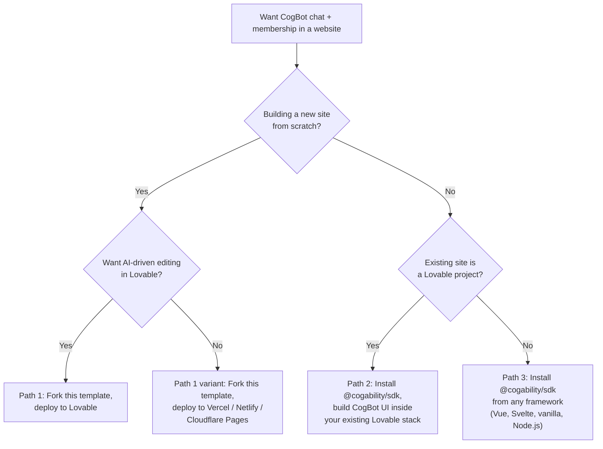
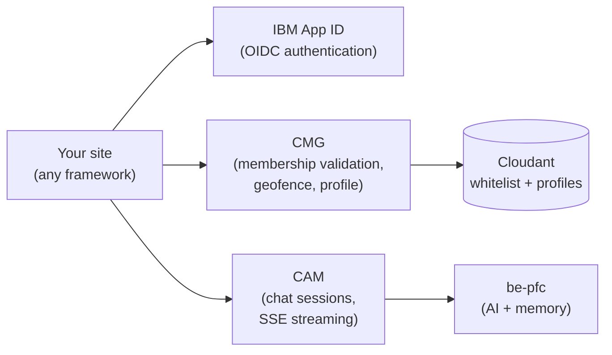

# Deployment Guidance

Three supported paths to put CogBot chat and IBM App ID membership into a website. Pick the one that matches your situation, then follow the step-by-step for that path plus the shared [Backend allowlisting](#backend-allowlisting) section at the end.

---

## Pick your path



| Path | Best for | Effort | Result |
|---|---|---|---|
| [Path 1](#path-1-fork-this-template-deploy-to-a-static-host) | New branded membership site | ~1 hour | Fully-featured SPA: public chat, App ID sign-in, member onboarding, gated pages, streaming chat, geofencing |
| [Path 2](#path-2-add-cogbot-to-an-existing-lovable-site) | Augmenting an existing Lovable project | ~half day (custom UI) | CogBot chat + membership checks wired into your existing layout, routing, and theme |
| [Path 3](#path-3-use-cogabilitysdk-from-any-web-app-or-nodejs-agent) | Any non-React site, non-Lovable host, or Node.js agent | Varies by framework | Direct HTTP clients — you own the UI entirely |

---

## What all three paths share

Regardless of frontend choice, CogBot membership sites speak to the same three backend services:



Six configuration values wire your site to this backend, regardless of path:

| Value | What it is | Where it goes |
|---|---|---|
| `APPID_CLIENT_ID` | App ID application client ID | `AuthClient` (OIDC login) |
| `APPID_OAUTH_SERVER_URL` | App ID OAuth server URL (tenant-specific) | `AuthClient` (OIDC discovery) |
| `CMG_URL` | Your deployed CMG base URL | `CmgClient` |
| `SITE_NAMESPACE` | Namespace key for member roles | `CmgClient` |
| `CAM_URL` | Your deployed CAM base URL | `CamClient` |
| `COGBOT_ID` | CogBot identifier (e.g. `mc_0091:full`) | `CamClient` |
| `ROUTER_MODE` (optional) | `path` (default) or `hash`. Use `hash` on hosts without SPA fallback (Lovable `*.lovable.app`, GitHub Pages without 404.html hack). Affects router type and OAuth `redirect_uri` shape. | `App` (`@cogability/membership-kit`) and `AuthClient` redirect URI |

In Vite projects these are named `VITE_*` (e.g. `VITE_CMG_URL`). In Node or other runtimes, name them however your framework wants. See [Obtaining credentials](#obtaining-credentials) for where to get the values.

After your site is live at its production URL, that origin must be added to three allowlists before CMG/CAM calls will work from the browser. This is the same three-step process for every deployment and is documented once in the shared [Backend allowlisting](#backend-allowlisting) section.

---

## Path 1: Fork this template, deploy to a static host

### When to use

- You are building a new membership site from scratch.
- You want the full feature set (public chat, App ID sign-in, onboarding wizard, profile page, members area with streaming chat, geofencing, access gates) without writing any UI code.
- You are comfortable editing a single JavaScript config file to customize content and branding.

### Prerequisites

- A GitHub account with access to where the forked repo will live (usually your own org).
- A hosting account: [Lovable](https://lovable.dev), [Vercel](https://vercel.com), [Netlify](https://netlify.com), or [Cloudflare Pages](https://pages.cloudflare.com).
- Six credentials values from your CogAbility contact — see [Obtaining credentials](#obtaining-credentials).
- Your branding: site name, bot name, hero copy, feature cards, testimonials, logos.

### Step 1 — Create your repo from the template

Click **Use this template → Create a new repository** on [this repo's GitHub page](https://github.com/CogAbility/cogbot-membership-website-template). Pick a target owner (your org) and name (e.g. `acme-membership`). Choose public or private at your discretion — the repo contents aren't sensitive.

This creates a clean copy with no upstream link to the template. You can pull future template improvements manually as cherry-picks or merges; this is rare.

### Step 2 — Customize branding and copy

Edit [`site.config.js`](site.config.js) — every user-visible string lives here. Quick checklist:

- `siteName`, `botName`, `orgName`, `orgUrl`, `poweredByName`
- `meta.title`, `meta.description` (page title + SEO + social sharing)
- `header.projectBadge`, `header.signInLabel`
- `hero.tagline`, `hero.subtitle`, `hero.stats`
- `features.items` (grid of feature cards)
- `testimonials.items`
- `about.paragraphs`, `about.checklist`
- `members.quickTips`, `members.botDescription`
- `onboarding` (step labels, welcome copy)
- `profile` (labels, headings)
- `footer` (brand name, nav links, copyright)

Replace the placeholder images in `public/`:

- `public/bot-icon.svg` — chat avatar
- `public/org-logo.svg` — "Presented by" logo
- `public/favicon.svg` — browser tab icon

If you use different file names or formats (`.webp`, `.png`, etc.), update the `images:` section in `site.config.js` accordingly.

Theme colors live in [`src/index.css`](src/index.css) under `:root` as HSL triples. The hero gradient adapts automatically to `--primary`.

### Step 3 — Add production env vars

The template's `.env.example` documents the six required `VITE_*` vars (plus an optional seventh, `VITE_ROUTER_MODE`, for hosts without SPA fallback). For **production**, create a committed `.env.production` file at the project root:

```bash
VITE_APPID_CLIENT_ID=<your_client_id>
VITE_APPID_OAUTH_SERVER_URL=<your_oauth_server_url>
VITE_CMG_URL=<your_cmg_url>
VITE_SITE_NAMESPACE=<your_namespace>
VITE_COGBOT_HOST=<your_cam_url>
VITE_COGBOT_ID=<your_cogbot_id>

# Optional. Set to "hash" only on hosts that don't do SPA fallback
# (Lovable *.lovable.app, GitHub Pages without 404.html hack).
# Default: "path" (clean URLs, conventional /callback redirect).
# VITE_ROUTER_MODE=hash
```

Why committed, not secret: these values end up in the public JavaScript bundle anyway (anyone can extract them from DevTools). They are identifiers, not credentials. The template's `.gitignore` excludes `.env` and `.env.local` but NOT `.env.production`, so committing this file is the intended pattern.

For **local development** with a dev backend, `.env.local` (gitignored) overrides `.env.production`:

```bash
cp .env.example .env.local
# edit .env.local with dev values
```

### Step 4a — Deploy to Lovable

Lovable hosts your site AND gives you an AI editing interface. Worth the extra setup if non-technical stakeholders will be iterating on copy.

**Important caveat**: Lovable (as of 2026) does not support direct "import from GitHub." Their GitHub sync is bidirectional code-mirroring, but you cannot point a new Lovable project at an existing GitHub repo. Workaround:

1. **Create an empty Lovable project.** Use a minimal seed prompt:

   > This project will be replaced wholesale via GitHub sync after we connect it. I am porting an existing React + Vite + Tailwind app from another repo. Please create the smallest possible scaffold — a single hello-world page, no router, no UI library, no extra components. Do not add Lovable Cloud features (no auth, no database, no storage). Project slug: `<your-slug>`. Just bootstrap the bare minimum so I can connect GitHub and overwrite it.

   Wait for Lovable's build to finish. You will get a URL like `https://<your-slug>.lovable.app`.

2. **Connect to GitHub.** Sidebar → **Connectors** → **GitHub** → **Connect project**. When the GitHub App install dialog appears, install the app on the same org/owner where your forked template lives. Click **Create Repository**. Lovable creates a NEW repo (separate from your template fork) and pushes its seed scaffolding to it.

3. **Clone Lovable's new repo locally:**

   ```bash
   git clone https://github.com/<owner>/<lovable-repo-name>.git
   cd <lovable-repo-name>
   ```

4. **Wipe Lovable's seed (preserving `.git/`):**

   ```bash
   find . -mindepth 1 -maxdepth 1 -not -name '.git' -exec rm -rf {} +
   ```

5. **Copy your customized template over:**

   ```bash
   rsync -a \
     --exclude='.git' \
     --exclude='node_modules' \
     --exclude='dist' \
     --exclude='.env' \
     --exclude='.env.local' \
     --exclude='.env.*.local' \
     /path/to/your/forked-template/ \
     ./
   ```

6. **Verify the build works locally:**

   ```bash
   npm install
   npm run build
   ```

7. **Commit and push:**

   ```bash
   git add -A
   git commit -m "Replace Lovable seed scaffold with customized template"
   git push origin main
   ```

8. **Wait 3–7 minutes.** Lovable's deploy is NOT on the same tick as the GitHub push. Verify by curling the live URL and checking the bundle hash:

   ```bash
   curl -s https://<your-slug>.lovable.app | grep -o '/assets/[a-z-]*\.js' | head -1
   # Compare to your local `ls dist/assets/*.js` — they should match
   ```

**Three Lovable quirks you will encounter:**

1. **The preview pane inside Lovable's editor stays blank or stale** even when the live deploy works fine. Always verify at the live `*.lovable.app` URL, not the embedded preview.

2. **Lovable's AI will suggest "Add app entry clean-up", "Verify Tailwind setup", "Add basic favicon", "Add root HTML metadata"** and similar tasks. These rewrite your code to match Lovable's default stack (TanStack Start + Tailwind v4 + TypeScript). Do not click them — they will break your site.

3. **Keep code changes in GitHub.** Lovable's 2-way sync means edits made in Lovable's editor push back to GitHub. For anything non-trivial, edit the GitHub repo directly (locally, via Cursor, via PR). Use Lovable's editor only for minor copy tweaks that the AI is good at.

**Static host caveat — Lovable does not do SPA fallback:**

Lovable's `*.lovable.app` static host returns 404 for any path that isn't an actual file in `dist/`. `_redirects` files are not honored on `*.lovable.app`. This breaks deep links like `/members` and the OAuth `/callback` route.

The kit (`@cogability/membership-kit ^0.3.0`) handles this when you set `VITE_ROUTER_MODE=hash` in `.env.production`. URLs become `/#/members`, and the OAuth redirect lands on `/` where the kit auto-detects `?code=&state=` and finishes login. Pair this with registering `https://<your-slug>.lovable.app/` (the site root, with trailing slash) in App ID — see [Mutation 3](#mutation-3-app-id-web-redirect-urls-ibm-cloud-ui).

### Step 4b — Deploy to Vercel, Netlify, or Cloudflare Pages

Simpler than Lovable. All three auto-detect Vite projects.

**Vercel:**

1. Go to [vercel.com/new](https://vercel.com/new), import your GitHub repo.
2. Framework Preset: **Vite** (auto-detected).
3. Build Command: `npm run build` (default).
4. Output Directory: `dist` (default).
5. Environment Variables: add the six `VITE_*` from your `.env.production` (Vercel reads them from both places, but adding to the dashboard is explicit and reliable) (no `VITE_ROUTER_MODE` needed — these hosts do SPA fallback natively, so the default `path` mode works).
6. Deploy. URL: `https://<project>.vercel.app` or your custom domain.

**Netlify:**

1. [netlify.com → New site from Git](https://app.netlify.com/start), connect your repo.
2. Build command: `npm run build`.
3. Publish directory: `dist`.
4. Environment Variables: same six `VITE_*` (no `VITE_ROUTER_MODE` needed — these hosts do SPA fallback natively, so the default `path` mode works).
5. Deploy. URL: `https://<project>.netlify.app` or custom domain.

**Cloudflare Pages:**

1. [dash.cloudflare.com → Pages → Create a project](https://dash.cloudflare.com/?to=/:account/pages) → Connect to Git.
2. Build command: `npm run build`.
3. Build output directory: `dist`.
4. Environment variables: same six `VITE_*` (Pages injects them at build time) (no `VITE_ROUTER_MODE` needed — these hosts do SPA fallback natively, so the default `path` mode works).
5. Deploy. URL: `https://<project>.pages.dev` or custom domain.

### Step 5 — Add your production origin to the three backend allowlists

After the first deploy, note your production URL (e.g. `https://acme-membership.lovable.app` or `https://acme.vercel.app` or `https://members.acme.com`).

Either do the three allowlist mutations yourself (if you have access) OR send your production URL to your CogAbility contact. See [Backend allowlisting](#backend-allowlisting) for the exact commands.

Until all three allowlists are updated, the live site will show:
- CORS errors in DevTools console when the page tries to check geofence or validate membership
- `redirect_uri_mismatch` error after clicking Sign In
- Chat widget showing "Unable to connect to Buddy"

### Step 6 — Smoke test

Open your production URL in an incognito window with DevTools Network tab open. Verify each leg:

1. **Anonymous geofence probe.** `GET <CMG_URL>/auth/geofence/check?namespace=<namespace>` should return `200 { geofenced: false }` (assuming you are inside the allowed geo). The landing page should render normally.
2. **Anonymous chat.** The public BuddyChat widget on the landing page should initialize (`POST <CAM_URL>/init`) and respond to messages.
3. **Sign in.** Click the sign-in button. App ID popup opens. After login: in `path` mode (default) you land at `<your-site>/callback`; in `hash` mode (Lovable, GitHub Pages) you briefly land at `<your-site>/?code=&state=` and the kit silently navigates to `<your-site>/#/...`. Either way, `POST <CMG_URL>/auth/validate` returns membership info next. New users go to `/onboarding`; existing members go to `/members`.
4. **Authenticated chat.** On `/members`, send a chat message. Streaming response arrives via SSE. Agent has access to your profile + long-term memory.

If any leg fails, cross-reference the [Troubleshooting](#troubleshooting) table.

---

## Path 2: Add CogBot to an existing Lovable site

### When to use

- You already have a Lovable project with your site's brand, layout, and content.
- You want to add CogBot chat + gated member features without rebuilding the site on a different template.
- You are comfortable writing custom React (or whatever framework Lovable's default stack uses) against the `@cogability/sdk` primitives.

### Constraint: the full membership-kit does NOT drop into Lovable's default stack

Lovable's current scaffolding (as of 2026) uses:
- TanStack Start + TanStack Router (file-based `src/routes/`)
- Tailwind CSS v4
- TypeScript (`.tsx`)
- Cloudflare Workers deployment target
- Bun as the runtime/toolchain for dev

`@cogability/membership-kit` is:
- React 19 + React Router v7
- Tailwind CSS v3
- JavaScript (`.jsx`)
- Static Vite build target
- npm

Three incompatibilities prevent the kit from dropping in:

1. **Router conflict.** The kit's `<App>` component owns its own React Router tree. TanStack Router in your Lovable app also owns routing. Two routers cannot coexist for the same URLs.
2. **Tailwind version conflict.** Kit class names are authored against Tailwind v3 semantics and its default token set. Running against Tailwind v4 (different config shape, different default tokens) results in broken styling.
3. **Bootstrap mismatch.** The kit expects to be mounted via `createRoot(...).render(<App config={config}/>)` in a Vite `src/main.jsx` entry. TanStack Start expects `src/routes/__root.tsx` as the root route in a server-entry setup.

### Recommended approach: SDK-only integration

Install just [`@cogability/sdk`](https://www.npmjs.com/package/@cogability/sdk) (no UI kit) and build your own CogBot UI inside your Lovable app's existing components and routing.

```bash
npm install @cogability/sdk oidc-client-ts
```

### Step 1 — Configure the SDK

Create a module that exports configured client instances. Name and location follow your app's conventions (e.g. `src/lib/cogability.ts` in a Lovable TanStack project):

```ts
import {
  AuthClient,
  BrowserSessionStore,
  CamClient,
  CmgClient,
} from "@cogability/sdk";

const env = import.meta.env;

export const cam = new CamClient({
  host: env.VITE_COGBOT_HOST,
  cogbotId: env.VITE_COGBOT_ID,
  sessionStore: new BrowserSessionStore(),
});

export const cmg = new CmgClient({
  host: env.VITE_CMG_URL,
  namespace: env.VITE_SITE_NAMESPACE,
});

export const auth = new AuthClient({
  authorityUrl: env.VITE_APPID_OAUTH_SERVER_URL,
  clientId: env.VITE_APPID_CLIENT_ID,
  redirectUri: `${window.location.origin}/callback`,
  // Routes token exchange through CMG to avoid App ID CORS restrictions:
  tokenEndpointProxy: `${env.VITE_CMG_URL}/auth/token`,
});
```

**On hosts without SPA fallback** (Lovable `*.lovable.app`, GitHub Pages without 404.html hack): override `redirectUri` to `` `${window.location.origin}/` `` and add a small bootstrapper that calls `auth.handleCallback()` when `URLSearchParams(location.search).has('code')` on the root route. See [Step 4a static host caveat](#step-4a--deploy-to-lovable).

Env vars: same six values as Path 1 (plus optional `VITE_ROUTER_MODE` — typically you'll set this to `hash` for Path 2 since you're already on Lovable). Set them via Lovable's GitHub sync by committing `.env.production` at the root of your Lovable repo.

### Step 2 — Wire the pieces you need

You need five UI touchpoints, each a few lines of code against the SDK:

**2a. Anonymous geofence gate.** On any page that should be hidden in disallowed regions (typically the landing page), call the geofence check on mount. Example as a React hook:

```tsx
import { useEffect, useState } from "react";
import { cmg } from "@/lib/cogability";

export function useGeofence() {
  const [result, setResult] = useState<
    { loading: true } | { loading: false; geofenced: boolean; message?: string }
  >({ loading: true });
  useEffect(() => {
    cmg.checkGeofence().then(({ geofenced, message }) =>
      setResult({ loading: false, geofenced: !!geofenced, message })
    );
  }, []);
  return result;
}
```

**2b. Sign-in button.** Anywhere in your existing layout:

```tsx
import { auth } from "@/lib/cogability";

<button onClick={() => auth.login("/members")}>Sign in</button>
```

`auth.login(returnPath)` redirects to App ID; after successful login the user lands at your `/callback` route, then gets forwarded to `returnPath`.

**2c. Callback route.** Create a page at `/callback` (TanStack Router: `src/routes/callback.tsx`). Its job is to finalize the OIDC handshake and validate membership:

```tsx
import { useEffect } from "react";
import { useNavigate } from "@tanstack/react-router"; // or your router
import { auth, cmg } from "@/lib/cogability";

export default function CallbackPage() {
  const navigate = useNavigate();
  useEffect(() => {
    (async () => {
      const { user, idToken } = await auth.handleCallback();
      const membership = await cmg.validateMembership(idToken);
      if (membership.isMember) {
        if (membership.autoProvisioned) {
          navigate({ to: "/onboarding" });
        } else {
          navigate({ to: "/members" });
        }
      } else {
        navigate({ to: "/access-denied" });
      }
    })();
  }, []);
  return <div>Signing you in...</div>;
}
```

If you're deploying to `*.lovable.app`, do not rely on a `/callback` route — instead handle the OAuth params at your existing root route (`/`). See [Step 4a static host caveat](#step-4a--deploy-to-lovable).

**2d. Members-only route gate.** For any page that requires membership:

```tsx
import { useEffect, useState } from "react";
import { auth, cmg } from "@/lib/cogability";

export function useMembership() {
  const [state, setState] = useState<{ loading: true } | {
    loading: false;
    isMember: boolean;
    roles: string[];
    idToken: string | null;
  }>({ loading: true });
  useEffect(() => {
    const idToken = auth.getIdToken();
    if (!idToken) return setState({ loading: false, isMember: false, roles: [], idToken: null });
    cmg.validateMembership(idToken).then((m) =>
      setState({ loading: false, isMember: m.isMember, roles: m.roles || [], idToken })
    );
  }, []);
  return state;
}
```

Then in your protected page component: if `!loading && !isMember`, redirect to an access-denied page.

**2e. Chat widget.** Wherever you want CogBot to appear (landing page, members page, embedded panel):

```tsx
import { useState, useEffect } from "react";
import { cam, CamClient } from "@cogability/sdk";

export default function BuddyChat({ idToken }: { idToken?: string }) {
  const [ready, setReady] = useState(false);
  const [messages, setMessages] = useState<Array<{ role: string; text: string }>>([]);

  useEffect(() => {
    (async () => {
      if (idToken) await cam.initAuthenticated(idToken);
      else await cam.initAnonymous();
      await cam.initCogbot();
      const greeting = await cam.fetchGreeting();
      const parts = CamClient.parseResponseGeneric(greeting)
        .filter((g) => g.response_type === "text");
      if (parts[0]) setMessages([{ role: "bot", text: parts[0].text }]);
      setReady(true);
    })();
  }, [idToken]);

  async function send(text: string) {
    setMessages((m) => [...m, { role: "user", text }, { role: "bot", text: "" }]);
    for await (const ev of cam.streamMessage(text, { anonymous: !idToken })) {
      if (ev.eventName === "partial_object") {
        const parts = CamClient.parseResponseGeneric(ev.data)
          .filter((g) => g.response_type === "text");
        if (parts[0]) {
          setMessages((m) => [
            ...m.slice(0, -1),
            { role: "bot", text: parts[0].text },
          ]);
        }
      }
    }
  }

  // render your chat UI here
}
```

For deeper examples (non-streaming, Node agents, vanilla JS), see [`@cogability/sdk` README](https://www.npmjs.com/package/@cogability/sdk).

### Step 3 — Add your Lovable origin to the three backend allowlists

Same as Path 1. See [Backend allowlisting](#backend-allowlisting).

### Step 4 — Smoke test

Open your Lovable site, DevTools Network tab open. Same smoke checks as Path 1 Step 6.

### Lovable AI behavior to watch for

When you `npm install @cogability/sdk`, Lovable's AI may suggest:

- "Migrate to TanStack Query" — fine, the SDK's async methods wrap cleanly.
- "Move SDK calls into server functions" — dangerous. `AuthClient` uses `window.location`, `window.sessionStorage`, and browser-only OIDC flows. These cannot run on the server. If Lovable's AI moves `auth.handleCallback()` into a server function, the callback will throw.
- "Add error boundaries around chat" — fine and recommended.
- "Replace `oidc-client-ts` with a simpler custom flow" — do not accept. The SDK's `AuthClient` wraps `oidc-client-ts` specifically because getting OIDC PKCE + token refresh + silent renewal right is non-trivial.

Guard rail: mark any file that imports `AuthClient` or calls `auth.*` as client-only (`"use client"` in Next.js-style meta-frameworks; for TanStack Start, ensure the component is in a non-server-function call path). All SDK code other than `AuthClient` also works on the server (Node-safe).

---

## Path 3: Use `@cogability/sdk` from any web app or Node.js agent

### When to use

- You are integrating with an existing site that is NOT a Lovable project and NOT a React app.
- You are building a Node.js agent, a Cloudflare Worker, or other server-side code that needs to call CAM or CMG.
- You want the minimum possible dependency surface — just HTTP clients.

### Prerequisites

- Node.js 18+ or a modern browser with `fetch` support.
- The same six configuration values as the other paths (plus optional `VITE_ROUTER_MODE` if you are building a browser SPA on a host without SPA fallback).

### Step 1 — Install

```bash
npm install @cogability/sdk
```

For browser OIDC flows (Path 3 browser case), also install the peer:

```bash
npm install oidc-client-ts
```

Node.js agents and server code typically skip `oidc-client-ts` — they receive tokens from elsewhere (the calling request's auth header, a pre-provisioned service account, etc.).

### Step 2a — Browser integration (Vue, Svelte, vanilla JS, Angular, etc.)

Same three clients as Path 2 (`CamClient`, `CmgClient`, `AuthClient`). The SDK has no React dependency — `AuthClient` uses only `window`, `fetch`, and `oidc-client-ts`, all framework-neutral.

**Vue (Options API) chat example:**

```vue
<script>
import { CamClient, BrowserSessionStore } from "@cogability/sdk";

export default {
  data() {
    return {
      cam: null,
      messages: [],
      input: "",
      ready: false,
    };
  },
  async mounted() {
    this.cam = new CamClient({
      host: import.meta.env.VITE_COGBOT_HOST,
      cogbotId: import.meta.env.VITE_COGBOT_ID,
      sessionStore: new BrowserSessionStore(),
    });
    await this.cam.initAnonymous();
    await this.cam.initCogbot();
    this.ready = true;
  },
  methods: {
    async send() {
      const text = this.input;
      this.input = "";
      this.messages.push({ role: "user", text });
      const botIdx = this.messages.push({ role: "bot", text: "" }) - 1;
      for await (const ev of this.cam.streamMessage(text)) {
        if (ev.eventName === "partial_object") {
          const parts = CamClient.parseResponseGeneric(ev.data)
            .filter((g) => g.response_type === "text");
          if (parts[0]) this.messages[botIdx].text = parts[0].text;
        }
      }
    },
  },
};
</script>
```

**Svelte, Angular, vanilla JS** — same pattern. See [`@cogability/sdk` README — Vue / vanilla JS](https://www.npmjs.com/package/@cogability/sdk#vue--vanilla-js--drop-in-chat-widget).

### Step 2b — Node.js agent

Node agents skip OIDC entirely — they receive tokens from an upstream call (e.g. an API request) or are pre-provisioned with service-account credentials.

```js
import { CamClient, CmgClient, MemorySessionStore } from "@cogability/sdk";

const cam = new CamClient({
  host: process.env.COGBOT_HOST,
  cogbotId: process.env.COGBOT_ID,
  sessionStore: new MemorySessionStore(),
  getHostUrl: () => "https://agent.example.com",
});

const cmg = new CmgClient({
  host: process.env.CMG_URL,
  namespace: process.env.SITE_NAMESPACE,
});

// Anonymous session
await cam.initAnonymous();
await cam.initCogbot();

// Authenticated: pass a pre-obtained idToken
const membership = await cmg.validateMembership(idToken);
if (membership.isMember) {
  await cam.initAuthenticated(idToken);
}

// Stream a response
for await (const { eventName, data } of cam.streamMessage("What are my benefits?")) {
  if (eventName === "final_response") {
    const text = CamClient.parseResponseGeneric(data)
      .filter((g) => g.response_type === "text")
      .map((g) => g.text)
      .join("\n");
    console.log(text);
  }
}
```

Use `MemorySessionStore` (in-process Map) instead of `BrowserSessionStore` (which wraps `window.sessionStorage` and does not exist in Node).

### Step 2c — Cloudflare Worker / edge runtime

Same pattern as Node. Use `MemorySessionStore`. Do not use `AuthClient` (no DOM). Pass tokens explicitly from the incoming request's `Authorization` header.

```js
import { CamClient, CmgClient, MemorySessionStore } from "@cogability/sdk";

export default {
  async fetch(request, env) {
    const idToken = request.headers.get("Authorization")?.replace(/^Bearer /, "");
    const cmg = new CmgClient({ host: env.CMG_URL, namespace: env.SITE_NAMESPACE });
    const membership = await cmg.validateMembership(idToken);
    if (!membership.isMember) return new Response("Unauthorized", { status: 401 });
    // ... proceed with chat, profile, etc.
  },
};
```

### Step 2d — Handoff from an existing auth system

If your site already has authentication (Auth0, NextAuth, Cognito, Clerk, Supabase Auth, etc.), you can skip `AuthClient` entirely. What CMG needs is an `idToken` that App ID issued for the user. If your existing auth system federates to App ID (e.g. you configured Auth0 to use App ID as an upstream OIDC provider), you can extract the App ID-issued token and pass it to `cmg.validateMembership(idToken)` + `cam.initAuthenticated(idToken)`.

If your auth system does NOT federate to App ID, you need a parallel auth flow via `AuthClient` or you need to work with CogAbility to configure federation. Contact your CogAbility contact for the options.

### Step 3 — Backend allowlisting

Same three mutations as the other paths. If you are running a browser SPA, your production origin must be in CAM and CMG allowlists. If you are running a Node agent or edge worker, your origin is either absent (server-to-server calls bypass browser CORS) OR present as your worker's origin.

See [Backend allowlisting](#backend-allowlisting).

### Step 4 — Smoke test

From a browser context:

```js
const res = await fetch(`${CMG_URL}/auth/geofence/check?namespace=${NAMESPACE}`);
console.log(await res.json()); // should return { geofenced: false, ... }
```

From Node:

```js
import { CmgClient } from "@cogability/sdk";
const cmg = new CmgClient({ host: CMG_URL, namespace: NAMESPACE });
console.log(await cmg.checkGeofence());
```

---

## Backend allowlisting

Your site's production origin must be added to three separate allowlists before it can reach CAM and CMG from the browser. If any of the three is missing, the corresponding leg of the flow fails. This section applies equally to Paths 1, 2, and 3.

Three allowlists, three different mutation mechanisms:

| # | What | Where it lives | How to mutate |
|---|---|---|---|
| 1 | CAM CORS | Cloudant `cors-whitelist` DB, doc with `_id` = `<CORS_WHITELIST_KEY>`, field `whitelist` (array of origins) | HTTP PUT the doc back with `_rev` + updated array |
| 2 | CMG `ALLOWED_ORIGINS` | Kubernetes Secret `cmg-secrets` in the namespace where CMG runs, key `ALLOWED_ORIGINS` (comma-separated string) | `kubectl patch` the secret, then `kubectl rollout restart` the CMG deployment |
| 3 | App ID web redirect URLs | IBM Cloud console → App ID instance → Applications → your client → Web redirect URLs (list) | Click in the IBM Cloud UI (no public API for this field) |

Who runs these steps depends on access:

- **If you are CogAbility ops** and have access to the production AWS, Kubernetes, and IBM Cloud accounts, do all three yourself.
- **If you are a client** deploying against CogAbility-managed infra, run only step 3 if you have App ID console access (usually yes) and ask your CogAbility contact to run steps 1 and 2.

### Mutation 1: CAM CORS (Cloudant)

CAM reads its CORS whitelist from a Cloudant document every 5 minutes. No CAM restart is needed after the update — just wait up to 5 minutes, or restart the CAM pod for immediate refresh.

**Naming gotcha — read carefully.** Cloudant has two databases with similar names:

- `whitelist` — this is the CMG member-access allowlist (emails). **NOT what we want.**
- `cors-whitelist` — this is the CAM CORS allowlist. **This is the one.**

Inside `cors-whitelist`, each doc has a field literally named `whitelist` which is the array of allowed origins. So the target is `cors-whitelist` DB → doc `<CORS_WHITELIST_KEY>` → field `whitelist`.

**Sanity check before writing:** the current `whitelist` array should contain origins like `https://<existing-prod-site>`. If you see email addresses instead, you are in the wrong DB — stop and re-verify.

**Step-by-step (CogAbility ops, using AWS Secrets Manager at `/mc-cap1/secrets` as the credential source):**

```bash
# Pull credentials
CREDS=$(aws secretsmanager get-secret-value \
  --secret-id /mc-cap1/secrets \
  --query SecretString --output text)
CLOUDANT_URL=$(echo "$CREDS" | python3 -c "import sys,json; print(json.load(sys.stdin)['CLOUDANT_URL'])")
CLOUDANT_APIKEY=$(echo "$CREDS" | python3 -c "import sys,json; print(json.load(sys.stdin)['CLOUDANT_APIKEY'])")
CORS_WHITELIST_KEY=$(echo "$CREDS" | python3 -c "import sys,json; print(json.load(sys.stdin)['CORS_WHITELIST_KEY'])")

# Get an IAM bearer token (Cloudant IAM apikeys are not compatible with basic auth)
TOKEN=$(curl -sf -X POST \
  "https://iam.cloud.ibm.com/identity/token" \
  -H "Content-Type: application/x-www-form-urlencoded" \
  -d "grant_type=urn:ibm:params:oauth:grant-type:apikey&apikey=$CLOUDANT_APIKEY" \
  | python3 -c "import sys,json; print(json.load(sys.stdin)['access_token'])")

# Read the current doc
DOC=$(curl -sf -H "Authorization: Bearer $TOKEN" \
  "$CLOUDANT_URL/cors-whitelist/$CORS_WHITELIST_KEY")

echo "$DOC" | python3 -m json.tool | grep -E '(_id|_rev|whitelist)'

# Construct the updated whitelist (replace NEW_ORIGIN below)
NEW_ORIGIN="https://your-site.example.com"
REV=$(echo "$DOC" | python3 -c "import sys,json; print(json.load(sys.stdin)['_rev'])")
NEW_LIST=$(echo "$DOC" | python3 -c "
import sys,json
d = json.load(sys.stdin)
lst = d['whitelist']
new = '$NEW_ORIGIN'
if new not in lst: lst.append(new)
print(json.dumps(lst))
")

# PUT the doc back
curl -sf -X PUT \
  -H "Authorization: Bearer $TOKEN" \
  -H "Content-Type: application/json" \
  "$CLOUDANT_URL/cors-whitelist/$CORS_WHITELIST_KEY" \
  -d "{\"_rev\":\"$REV\",\"whitelist\":$NEW_LIST}" \
  | python3 -m json.tool
```

Expect `{"ok": true, "id": "...", "rev": "..."}` as response.

**Verify the new origin is accepted (after 5-minute cache refresh, or CAM pod restart):**

```bash
curl -i -X OPTIONS <CAM_URL>/init \
  -H "Origin: https://your-site.example.com" \
  -H "Access-Control-Request-Method: POST"
```

Expect `access-control-allow-origin: https://your-site.example.com` in the response headers.

### Mutation 2: CMG `ALLOWED_ORIGINS` (Kubernetes)

CMG's `ALLOWED_ORIGINS` lives in the `cmg-secrets` Kubernetes Secret, not as an inline `env:` on the deployment. Changing it means patching the secret and restarting the pod (secrets injected via `envFrom` are not hot-reloaded).

**Important: preserve every existing origin** when patching — you are appending, not replacing.

```bash
# Fetch current value to confirm what you are appending to
kubectl get secret/cmg-secrets -n <cmg-namespace> \
  -o jsonpath='{.data.ALLOWED_ORIGINS}' | base64 -d ; echo ""
# Expect: https://<existing-origin-1>,https://<existing-origin-2>

# Patch with the new comma-separated string (include ALL existing origins)
kubectl patch secret/cmg-secrets -n <cmg-namespace> \
  --type=merge \
  -p '{"stringData":{"ALLOWED_ORIGINS":"https://<existing-1>,https://<existing-2>,https://your-site.example.com"}}'

# Restart CMG so it picks up the new secret value
kubectl rollout restart deployment/cmg -n <cmg-namespace>
kubectl rollout status  deployment/cmg -n <cmg-namespace>

# Verify
kubectl get secret/cmg-secrets -n <cmg-namespace> \
  -o jsonpath='{.data.ALLOWED_ORIGINS}' | base64 -d ; echo ""

curl -i -H "Origin: https://your-site.example.com" \
  "<CMG_URL>/auth/geofence/check?namespace=<namespace>"
```

Expect the secret value to include your new origin and the curl response to include `access-control-allow-origin: https://your-site.example.com`.

Why `stringData` and not `data`: `stringData` accepts raw strings and lets Kubernetes handle base64 encoding. A merge patch on `stringData` updates only the `ALLOWED_ORIGINS` key without affecting the other keys in the secret.

### Mutation 3: App ID web redirect URLs (IBM Cloud UI)

App ID's redirect URL list is not exposed via a public API — it must be edited in the IBM Cloud console.

1. Go to [cloud.ibm.com](https://cloud.ibm.com), log in.
2. Navigation menu (top-left) → **Resource list** → expand **Services and software**.
3. Find the App ID instance whose **Tenant ID** matches your tenant. Click it.
4. Left sidebar → **Applications**.
5. Find the application row with the **clientId** matching your `APPID_CLIENT_ID`. Click to expand.
6. Locate the **Web redirect URLs** multi-input field.
7. Add your site's callback URL. **What URL to register depends on your router mode:**

   - **`path` mode (default — Vercel, Netlify, Cloudflare, custom CDN):**
     ```
     https://your-site.example.com/callback
     ```
     The kit's `BrowserRouter` matches `/callback` to the route that finishes login.

   - **`hash` mode (Lovable `*.lovable.app`, GitHub Pages without 404 hack):**
     ```
     https://your-site.example.com/
     ```
     Trailing slash matters. The kit's `HashRouter` cannot rely on a `/callback` path because the host returns 404. OAuth lands at the site root and the kit detects `?code=&state=` and finishes login. Do NOT register `https://your-site.example.com/#/callback` — RFC 6749 forbids fragments in `redirect_uri` and App ID will reject it.

8. Keep all existing redirect URLs. Do not remove anything.
9. Click **Save**.

Verify by constructing the App ID authorize URL manually and opening it in an incognito browser:

```
# path mode:
<APPID_OAUTH_SERVER_URL>/authorization?client_id=<APPID_CLIENT_ID>&response_type=code&redirect_uri=https%3A%2F%2Fyour-site.example.com%2Fcallback&scope=openid&state=test

# hash mode:
<APPID_OAUTH_SERVER_URL>/authorization?client_id=<APPID_CLIENT_ID>&response_type=code&redirect_uri=https%3A%2F%2Fyour-site.example.com%2F&scope=openid&state=test
```

Expect the App ID login page to render (no `redirect_uri_mismatch` error).

### What happens if you skip one

| Skipped allowlist | Symptom |
|---|---|
| CAM CORS | Public chat widget shows "Unable to connect to Buddy". DevTools shows CORS preflight failures on `<CAM_URL>/init`. |
| CMG ALLOWED_ORIGINS | Landing page renders but geofence probe fails. DevTools shows CORS preflight failure on `<CMG_URL>/auth/geofence/check`. Sign-in may also fail depending on which CMG endpoint runs first. |
| App ID redirect URLs | Sign-in popup opens, user enters credentials, App ID responds with `redirect_uri_mismatch` and refuses to redirect back. User is stranded on the App ID error page. |

---

## Obtaining credentials

### If you are a CogAbility client or partner

Your CogAbility contact provides a credentials sheet with these six values (plus an optional seventh, `ROUTER_MODE`, that the deployer sets based on their host's SPA-fallback support):

- `APPID_CLIENT_ID`
- `APPID_OAUTH_SERVER_URL`
- `CMG_URL`
- `SITE_NAMESPACE`
- `CAM_URL`
- `COGBOT_ID`

The values are not secret in the cryptographic sense (they end up in your public JavaScript bundle) but your CogAbility contact is the source of truth for which specific instances you are connecting to. Contact: support@cogability.net (or whoever on the CogAbility team is your point of contact).

### If you are CogAbility ops

Production values live in AWS Secrets Manager. The mapping:

| Env var | AWS SM key (at `/mc-cap1/secrets`) |
|---|---|
| `VITE_APPID_CLIENT_ID` | derive from App ID instance (see IBM Cloud console) |
| `VITE_APPID_OAUTH_SERVER_URL` | derive from App ID tenant ID |
| `VITE_CMG_URL` | `cmg.mc-cap1.cogability.net` (public DNS, not in SM) |
| `VITE_SITE_NAMESPACE` | varies per namespace (e.g. `bab`, `cu3`) |
| `VITE_COGBOT_HOST` | `cam.mc-cap1.cogability.net` (public DNS, not in SM) |
| `VITE_COGBOT_ID` | varies per namespace / site (see Cloudant cogbot docs) |
| `VITE_ROUTER_MODE` | deployer-determined; defaults to `path`. Set to `hash` for Lovable `*.lovable.app` or other hosts without SPA fallback. Not stored in SM. |

For Mutation 1 (CAM CORS), the three values pulled from SM are `CLOUDANT_URL`, `CLOUDANT_APIKEY`, `CORS_WHITELIST_KEY`. For Mutation 2, the Kubernetes access comes from your CloudShell `kubectl` config pointing at the `mc-cap1` EKS cluster.

### For local development

The template ships with `.env.example` documenting the six values (plus an optional seventh). Copy to `.env.local` (gitignored) and fill in dev-cluster credentials for local stack testing. See [`README.md` — Running Locally](README.md#running-locally) for the full local stack walkthrough (CMG + CAM + SPA together).

---

## Troubleshooting

Cross-references back to the path sections where the deeper context lives.

| Symptom | Root cause | Fix |
|---|---|---|
| Lovable deploy not updating after push (3+ min) | Lag; Lovable's deploy is not on the same tick as the GitHub push | Wait 5–7 minutes, verify via `curl` of live URL not the embedded preview pane |
| Lovable preview pane blank or stale | Lovable's preview environment is separate from the live deploy | Ignore the preview pane; verify at `https://<slug>.lovable.app` directly |
| Lovable's AI rewriting your site | Do not click the "Add app entry clean-up" / "Verify Tailwind setup" suggestions | Edit in GitHub, not in Lovable's AI chat. If Lovable already rewrote things, `git revert` and push |
| `VITE_*` values appear `undefined` in the built JS bundle | Env vars in `.env` or `.env.local` (not `.env.production`), OR the deploy happened before you committed the env file | Confirm `.env.production` is committed at the repo root; trigger a redeploy |
| CORS error in DevTools on `<CAM_URL>/init` | CAM CORS allowlist missing your origin | See [Mutation 1](#mutation-1-cam-cors-cloudant) |
| CORS error in DevTools on `<CMG_URL>/auth/*` | CMG `ALLOWED_ORIGINS` missing your origin | See [Mutation 2](#mutation-2-cmg-allowed_origins-kubernetes) |
| `redirect_uri_mismatch` from App ID after login | App ID web redirect URLs missing `<your-origin>/callback` (path mode) or `<your-origin>/` (hash mode) | See [Mutation 3](#mutation-3-app-id-web-redirect-urls-ibm-cloud-ui) |
| Blank page, no errors in console | One or more required `VITE_*` values missing | Verify all required values are set before the build ran |
| Build succeeds locally, fails on Lovable | Lovable may still have cached TanStack/Cloudflare config from the seed swap | Force redeploy with a trivial commit (whitespace, README change); Lovable re-detects the stack |
| Chat shows "initializing" forever in production | `VITE_COGBOT_HOST` or `VITE_COGBOT_ID` wrong, or CAM is unreachable from the user's network | Double-check values; try `curl <CAM_URL>/init -X POST -H 'Content-Type: application/json' -d '{}'` from the user's network |
| Sign-in works but user lands on Access Denied | Email not in Cloudant whitelist OR `SITE_NAMESPACE` mismatch between SPA and Cloudant cogbot doc | Cross-check namespace; ask your CogAbility contact to add the email or enable auto-provisioning |
| `AuthClient` throws `window is not defined` in Path 2 or 3 | `AuthClient` used in a server-rendered context (Next.js server component, TanStack Start server function, SSR framework) | Mark the consuming component as client-only; `AuthClient` is browser-only. Other SDK clients (`CamClient`, `CmgClient`) work on both |
| `/callback` returns 404 on `*.lovable.app` (or other host without SPA fallback) | Static host doesn't rewrite unknown paths to `index.html` | Set `VITE_ROUTER_MODE=hash` in `.env.production`, redeploy, register the site root (not `/callback`) in App ID. See [Step 4a static host caveat](#step-4a--deploy-to-lovable) |

---

## Further reading

- [`README.md`](README.md) — template overview, architecture diagrams, member onboarding flow, streaming, geofencing
- [`@cogability/sdk` README](https://www.npmjs.com/package/@cogability/sdk) — full SDK reference with code examples for React, Vue, vanilla JS, Node agents, and Cloudflare Workers
- [`CogAbility/cogability-packages`](https://github.com/CogAbility/cogability-packages) — SDK + membership-kit source, publish process, contributor notes
